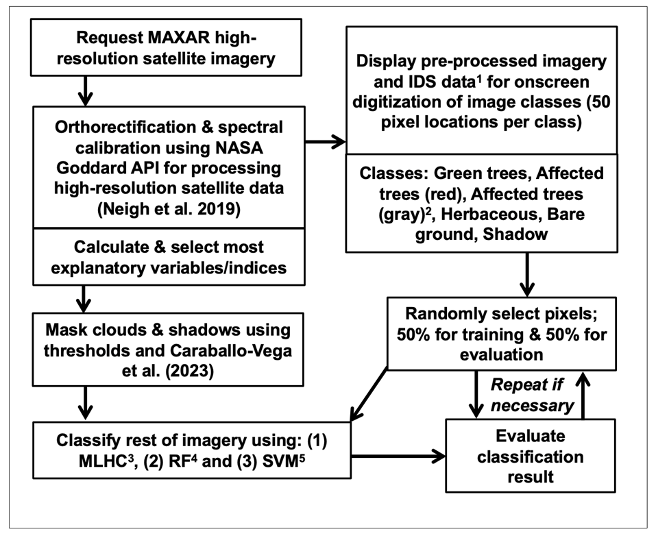

# Scripts

This sub-directory contains the relevant scripts for mapping biotic disturbances using very high-resolution satellite imagery from [NASA CSDA Program vendors](https://www.earthdata.nasa.gov/esds/csda). 

### Sub-directory information:
* The `DATA` and `EXPORTS` sub-directories contain relevant files that are `INPUT` and `OUTPUT` for the scripts in this folder.
* The `calc_wv_index.r` is a function required for the `SmallSat_class_insect_disturb_23121.R` main script. The `calc_wv_index.r` function takes multiband imagery as `input`, calculates indices, and exports a multiband raster as `output`.

### Image classification workflow:

  
*The workflow used for classifying high-resolution imagery that contain tree mortality from biotic disturbances; 1Insect and Disease Survey data (USDA Forest Service 2023), 2Affected gray trees were only included if they were present in the imagery, 3maximum likelihood classification, 4randomForest, 5support vector machine.*

#### Example result:

*Illustration of (a) WorldView-2 image zoom with a spruce beetle outbreak attacking Engelmann spruce trees in south central Colorado and (b) random forest classification results*
