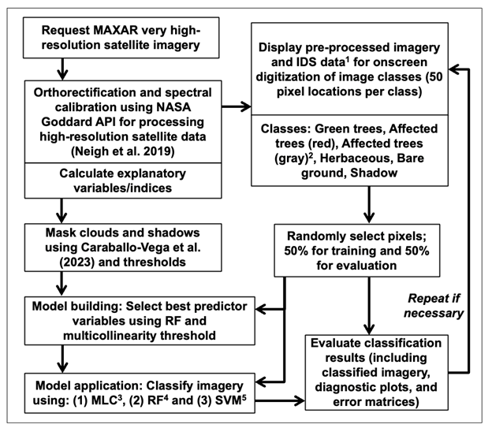
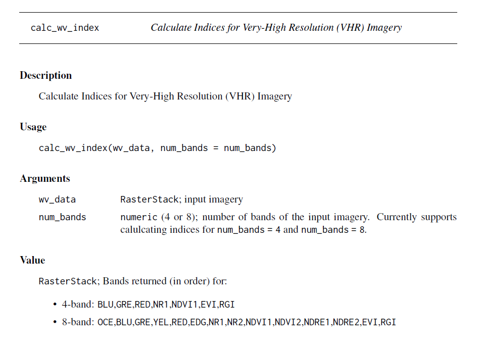

# Scripts

This sub-directory contains the relevant scripts for mapping biotic disturbances using very high-resolution satellite imagery from [NASA CSDA Program vendors](https://www.earthdata.nasa.gov/esds/csda). 

### Directory information:
1. [DATA](DATA) sub-directory contains the relevant files that are `INPUT` and `OUTPUT` for the classificaion pipeline. The [DATA](DATA) subdirectory consists of a "README" file that outlines the sub-folders and their contents.
2. The `RCode_SmallSat_class_insect_disturb_Meddens_etal_240826.R` is the <u>main script</u> for this project. 
    * _**NOTE:**_ the paths intialized in script are all relative, i.e., successful run of the script requires users to reflect the folder structure of this directory. If the entire repository is not cloned and absolute paths are used, please set the working directory with `setwd()` -- this would still require the user to reflect their folder structure to the structure of this repository in order to successfully run the script. 
    * The `INPUT` and `OUTPUT` are in the [DATA](DATA) subdirectory. 
    * The run parameters are passed via a .csv file that is read by the [main script](https://github.com/arjanmeddens/SmallSat/blob/main/scripts/RCode_SmallSat_class_insect_disturb_Meddens_etal_240826.R#L46). The .csv file is stored in the "shapefiles" sub-folder in the [DATA](DATA) subdirectory.
    * The script uses the workflow shown in the figure below:
    
    #### Image classification workflow: 
      

   *The workflow used for classifying high-resolution imagery that contain tree mortality from biotic disturbances; 1Insect and Disease Survey data (USDA Forest Service 2023), 2Affected gray trees were only included if they were present in the imagery, 3maximum likelihood classification, 4randomForest, 5support vector machine.*
    
    * #### Example result: 
      

   *Illustration of (a) WorldView-2 image zoom with a spruce beetle outbreak attacking Engelmann spruce trees in south central Colorado and (b) random forest classification results*

4. Functions present in this directory:
    * `calc_vhr_index.r` function is used in the image classification workflow. The function takes multiband imagery as `input`, calculates indices, and exports a multiband raster as `output` for data of type `RasterStack`. This function can also be used as a standalone function. Function documentation:
   

   * `write_smallsat_<OUTPUT>.R` are utility functions that output specific data from the classification pipeline in different file formats. Output files are stored in the "output" sub-folder in the [DATA](DATA) sub-directory. The set of utility functions include:

        * `write_smallsat_cfm.R`: function that outputs the confusion Matrices to a .csv file
        * `write_smallsat_info.R`: function that outputs the run parameters and summary of results to a .txt file
        * `write_smallsat_metrics.R`: function that outputs the classification metrics to a .csv file
